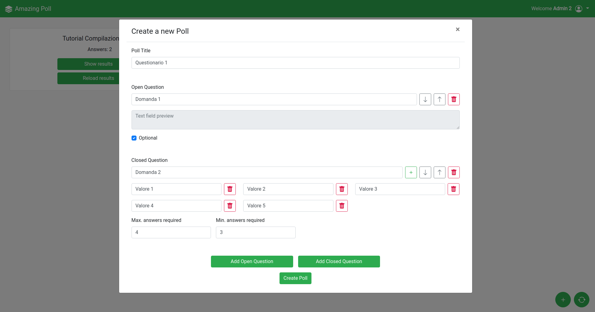

# Exam #1: "Questionario"

## Student: s281870 Cheinasso Francesco

## React Client Application Routes

- Route `/` : this route redirect to `/login`
- Route `/login` :  in this page the user chooses to vote or to create a new poll (and show his polls results). In case the user wants to create a new poll authentication will be requested.
- Route `/main` : main page where the user can perform some operations (vote, create, show results) according to the privileges that he has in that moment.

---

---

## API Server

- POST `/api/sessions`
  - request parameters : none
  - request body : an object with the authetication fields
    ```json
    {
      "username": "admin1@poll.it",
      "password": "Qwerty1234"
    }
    ```
  - response body : an object containing the manager's name
    ```json
    {
      "name": "Admin 1"
    }
    ```

---

- DELETE `/api/sessions/current`

  - request parameters : none
  - request body : none
  - response body : none

  This API lets the logged user to log out.

---

- GET `/api/polls`
  - request parameters: none
  - request body : none
  - response body content: an array of objects containing the polls' name and id. If a manager is logged in, the API will return only the information about the polls created by himself. if a user is not logged in, it will return the informations about all polls.
    ```json 
    [ 
      { "id": 73, "name": "Organizzazione cena del 29/06/2021" },
      { "id": 74, "name": "Opinione Prodotto" },
      { "id": 75, "name": "Tutorial Compilazione Poll" } 
    ] 
    ```

---

- GET `/api/polls/:id/questions`
  - request parameters : `id` which represents the poll's id
  - request body : None
  - response body : an array of objects where each object describes a question contained in the poll
    ```json
    [
      {
        "id": 291,
        "name": "Ci sarai?",
        "closed": true,
        "min": 1,
        "max": 1,
        "position": 0,
        "options": ["No", "Si"]
      },
      {
        "id": 292,
        "name": "Per che ora arrivi?",
        "closed": true,
        "min": 1,
        "max": 1,
        "position": 1,
        "options": ["19:00", "19:30", "20:00", "20:30", "21:00"]
      },
      {
        "id": 293,
        "name": "Cosa voresti mangiare?",
        "closed": true,
        "min": 0,
        "max": 2,
        "position": 2,
        "options": ["Carbonara", "Creppes", "Pizza", "Risotto"]
      },
      {
        "id": 294,
        "name": "Hai suggerimenti?",
        "closed": false,
        "min": 0,
        "max": 1,
        "position": 3,
        "options": []
      }
    ]
    ```

---

- GET `/api/polls/:id/answers`

  - request parameters : It is the id of a poll
  - request body : none
  - response body content : if user is not logged in, it returns:
    ```json
    [
      {
        "error": "not authenticated"
      }
    ]
    ```
    If user is logged in and the poll corrisponding to the passed parameters have been created by the logged user, the API will return an array of objects where each object represent a users answer to the poll.

    ```json
    [
      {
        "id_submission": 263,
        "user": "Francesco",
        "questions": [
          {
            "id_quest": 291,
            "values": ["Si"]
          },
          {
            "id_quest": 292,
            "values": ["19:30"]
          },
          {
            "id_quest": 293,
            "values": ["Carbonara"]
          },
          {
            "id_quest": 294,
            "values": ["Mi raccomando il guanciale e non la  pancetta"]
          }
        ]
      },
      {
        "id_submission": 264,
        "user": "Sara",
        "questions": [
          {
            "id_quest": 291,
            "values": ["Si"]
          },
          {
            "id_quest": 292,
            "values": ["21:00"]
          },
          {
            "id_quest": 293,
            "values": [null]
          },
          {
            "id_quest": 294,
            "values": [null]
          }
        ]
      }
    ]
    ```
    If the poll corresponding to the passed id doesn't exist or it hasn't been created by the logged user, the API will return a void array.

---

- POST `/api/polls`
  - request parameters : none
  - request body : an object representing the poll. It includes the name and an array of objects representing each one a question.
    ```json
    {
      "name": "Questionario nuovo",
      "questions": [
        {
          "name": "Domanda 1",
          "closed": false,
          "min": 0,
          "max": 1,
          "position": 1,
          "options": []
        },
        {
          "name": "Domanda 2",
          "closed": true,
          "min": 1,
          "max": 2,
          "position": 2,
          "options": ["Valore 1", "Valore 2"]
        }
      ]
    }
    ```
  - response body content : if the user is not logged in the API will respond with an error.
    ```json
    {
      "error": "not authenticated"
    }
    ```
    If the user is authenticated it will return the created poll's id
    ```json
    {
      "addedId": 76
    }
    ```

---

- POST `/api/submissions`
  - request parameters : none
  - request body : An object containing the id of a poll and a name.
    ```json
    {
      "id_poll": 74,
      "name_user": "Silvia"
    }
    ```
  - response body content : A submission id. It is used to associate a name to an answer (see the next API)
    ```json
    {
      "submissionId": 280
    }
    ```
---

- POST `/api/answers`
  - request parameters : none
  - request body : An object containing an id submission (which represent the voting user) and an array of objects where each object represents a question and the related user's answers.
    ```json
    {
      "id_submission": 256,
      "questions": [
          {
              "id_quest": 279,
              "values": []
    
          },
          { 
              "id_quest": 280,
              "values": ["Valore 1","Valore 2"]
          },
          { 
              "id_quest": 281,
              "values": ["Valore 1"]
          }
      ]
    }
    ```
  - response body content : none

---

**Every API returns an error Object if the request body is wrong**

---

## Database Tables

- Table `managers` - It contains id_manager, mail, hash (password's hash), name. Its goal is to record all the useful information about managers (logged users).
- Table `polls` - It contains id_poll, name_poll, id_manager (references managers.id_manager). Contain the poll's name and its creator's id.
- Table `questions` - It contains id_quest, name_quest, closed, min, max, id_poll (references polls.id_poll), position. It contains the information about questions and links it with a poll.
- Table `closedquestionoptions` - It contains id_option, value_option, id_quest (references questions.id_quest ).It contains the closed questions options and links them with the question.
- Table `submissions` - It contains id_submission, user, id_poll (references polls.id_poll). It associates a user (a string which represents a name) to a poll. Then the id_submission will be used from answers to associate an answer to a user and a poll.
- Table `answers` - It contains id_answer, id_submission (references submissions.id_submission), id_quest (references answers.id_quest), value. Each line represents an answer to a question. In case of a closed question more lines in this table will appear with the same id_questions and id_submission each representing a checked value. If a question is optional and the user doesn't give an answer, this table will contain a line with NULL in value.

---

---

## Main React Components

Main components

The majority of the components receive a props **mode**, which is used by the component to understand how to behave. The possible values are **'vote','results','create'**

- `LoginForm`: The component rendered in the '/login' route. It allows the user to choose to vote or to create a poll (and check the results of the existing ones). If the user chooses **vote** no authentication is required. If he chooses **create** the form will ask for credentials.
- `Main`: The root of the main page, it uses the prop **userName** to define the **mode** for the inner components. It receives from the server the basics information about polls (/api/polls) and renders the corresponding **PollPreview** components.
- `PollPreview`: A card containing the number of votes received (**results mode** only), the title of the poll and a button to vote or show the results/reload according to the mode (it opens the **PollModal** contained in the component). It contains the **Answers** state and set it in **results** mode.
- `PollModal`: It contains a modal, the **poll** state, and the next components. It receives the poll object from the server, containing the information about the poll and its questions (only in **vote** and  **results** modes).
- `PollClosedQuest`: Rendered in **vote** and **results** modes. It renders a closed question and allow to answer or to show the results.
- `PollClosedQuestOption`: Rendered in **vote** and  **results** modes. Contained by **PollClosedQuest** component, it represents a closed question's option. It sets the **answer** state in **vote** mode.
- `PollOpenQuest`: Rendered in **vote** and  **results** modes. It renders a open question and allow to answer or to show the results. It sets the **answer** state in **vote** mode.
- `PollClosedQuestCreate`: Rendered in **create** mode. It allows a manager to create a closed question. It sets the **poll** state.
- `PollClosedQuestOptionCreate`: Rendered in **create** mode. Contained by **PollClosedQuestCreate** component, it represents an option of a closed question. It sets the **poll** state.
- `PollOpenQuestCreate`: Rendered in **create** mode. It allows a manager to create an open question. It sets the **poll** state.
- `PollForm`: It contains the Form used to send the the answer/new poll to the server and to perform the validations. Different validations are performed and API are used according to the mode.
- `PollHeader`: Used in all modes. It is used to show/set the userName in **vote** and **results** mode or to set the poll's title in **create** mode. It sets **poll** or **userName** state.
- `PollPagination`: Rendered in **results** mode. It allows to navigate through the answers. It exploits and sets the **currentUserNum** state.
- `PollAddQuest`: Rendered in **create** mode. It allows to insert a new open/closed question. It sets the **poll** state.

---

---

## Screenshot



---

---

## Users Credentials

- email : `admin1@poll.it`, password : `Qwerty1234`
  - This manager has created the polls `Organizzazione cena del 29/06/2021` , `Opinione Prodotto`
- email : `admin2@poll.it`, password: `Qwerty1234`
  - This manager has created the poll `Tutorial Compilazione Poll`
